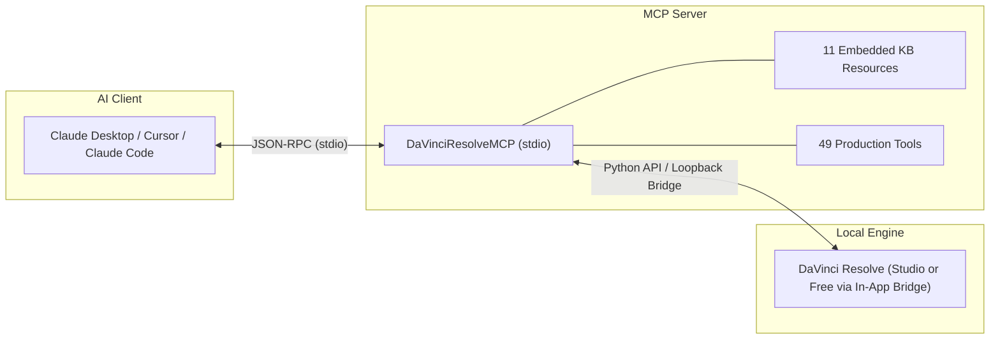

# DaVinci Resolve MCP Server 🎬🤖

[](https://www.python.org/downloads/)
[](https://www.blackmagicdesign.com/products/davinciresolve)
[](https://modelcontextprotocol.io)
[](LICENSE)
[]()

A high-performance **Model Context Protocol (MCP)** server that connects **DaVinci Resolve** to your favorite local AI assistants—including **Claude Desktop**, **Claude Code**, **Cursor**, **Windsurf**, and **Antigravity**.

Control video editing, media pools, timelines, Fusion graphics, Fairlight audio, color grading, and render queues using natural language over standard I/O (`stdio`).

---



---

## 📑 Table of Contents

- [🌟 Features](#-features)
- [📋 Prerequisites](#-prerequisites)
- [⚙️ DaVinci Resolve Configuration (Studio & Free)](#️-davinci-resolve-configuration-studio--free)
- [🚀 Quickstart Installation](#-quickstart-installation)
- [🔌 Client Configuration](#-client-configuration)
  - [Claude Desktop](#1-claude-desktop)
  - [Claude Code CLI](#2-claude-code-cli)
  - [Cursor / Windsurf / Antigravity](#3-cursor--windsurf--antigravity-ide)
- [💬 Example Prompts & Use Cases](#-example-prompts--use-cases)
- [🧰 Tool Catalog (49 Granular Tools)](#-tool-catalog-49-granular-tools)
- [📚 Knowledge Base Resources (`resolve-kb://`)](#-knowledge-base-resources-resolve-kb)
- [⚡ Pre-Built Workflow Prompts](#-pre-built-workflow-prompts)
- [🧪 Testing Your Connection](#-testing-your-connection)
- [❓ Troubleshooting & FAQ](#-troubleshooting--faq)
- [🔒 Privacy & Security](#-privacy--security)
- [📄 License](#-license)

---

## 🌟 Features

- **🚀 100% Local & Fast (`stdio`)**: Communicates directly over standard I/O with zero open network ports, zero latency, and zero cloud lock-in.
- **🆓 Supports BOTH Free & Studio Editions**: 
  - **Studio**: Connects directly via native external Python scripting API.
  - **Free**: Works seamlessly via our one-click In-App Loopback Bridge (`python install_bridge.py`), bypassing external scripting restrictions.
- **🎬 49 Granular Tools**: Deep coverage across all DaVinci Resolve pages:
  - **Project & Database**: Create, open, save, query settings, and inspect projects.
  - **Media Pool**: Ingest assets, organize folders/bins, and construct timelines.
  - **Timeline & Inspector**: Crop, pan, tilt, zoom, composite modes, track inspection, and colored markers.
  - **Fusion & Titles**: Text+, lower thirds, generators, and Fusion composition node inspection.
  - **Fairlight Audio**: AI Voice Isolation (0–100%, Studio), auto subtitles (Studio), and Fairlight track presets.
  - **Color Grading**: CDL balance (Slope/Offset/Power/Saturation), 3D LUTs (.cube), `.drx` grades, and color versions.
  - **Deliver & Render**: Export presets (YouTube, ProRes, H.264), queue management, render monitoring, and controls.
- **🧠 11 Embedded Knowledge Base Resources (`resolve-kb://`)**: Feeds the LLM comprehensive knowledge of Resolve API parameters, valid ranges, and safe workarounds.
- **🛡️ Defensive & Non-Destructive**: Built-in timeline duplication, color version branching, and clear error diagnostics if Resolve is closed or misconfigured.
- **🌐 Cross-Platform**: Works seamlessly on macOS, Windows, and Linux.

---

## 📋 Prerequisites

Before installing the server, ensure you have:

1. **DaVinci Resolve**:
   - **Both DaVinci Resolve Free and DaVinci Resolve Studio** are fully supported! (v18, v19, v20+).
   - *Studio edition* connects natively via external scripting.
   - *Free edition* connects seamlessly using our built-in In-App Bridge.
2. **Python 3.10+**:
   - Python 3.10, 3.11, 3.12, or 3.13 installed on your system.
3. **An MCP-Compatible Client**:
   - Claude Desktop, Claude Code, Cursor, Windsurf, Antigravity, or any standard MCP client.

---

## ⚙️ DaVinci Resolve Configuration (Studio & Free)

Follow the quick setup corresponding to your DaVinci Resolve edition:

### Option A: DaVinci Resolve Studio (Native API)
Studio edition supports direct external scripting with zero ongoing steps:
1. Open DaVinci Resolve Studio.
2. Open **Preferences**:
   - **macOS**: `DaVinci Resolve` > `Preferences...` (or `Cmd + ,`)
   - **Windows / Linux**: `Edit` > `Preferences...` (or `Ctrl + ,`)
3. Navigate to **System** > **General**.
4. Set **External scripting using** to **Local** (or **Network**).
5. Click **Save**.

### Option B: DaVinci Resolve Free Edition (In-App Bridge)
Blackmagic Design restricts external process scripting in the Free edition. To enable MCP automation on the Free edition:
1. Run the one-line installer from your terminal:
   ```bash
   python install_bridge.py
   ```
2. Open DaVinci Resolve and load any project.
3. In the top menu bar, click:
   **Workspace > Scripts > Utility > davinci_resolve_mcp_bridge**
4. A console banner will confirm: `Active & Listening on http://127.0.0.1:9099`.
5. Keep DaVinci Resolve open. The MCP server will automatically detect and route all commands through this bridge!

> [!TIP]
> Keep DaVinci Resolve running with a project open whenever you interact with the MCP server through your AI assistant.

---

## 🚀 Quickstart Installation

### 1. Clone the Repository

```bash
git clone https://github.com/au-yong/davinci-resolve-mcp.git
cd davinci-resolve-mcp
```

*(Replace with your actual cloned path or current folder)*

### 2. Set Up a Virtual Environment

```bash
# Create a virtual environment
python3 -m venv .venv

# Activate it:
# On macOS / Linux:
source .venv/bin/activate

# On Windows (PowerShell):
# .venv\Scripts\Activate.ps1

# On Windows (Command Prompt):
# .venv\Scripts\activate.bat
```

### 3. Install Dependencies

```bash
pip install -r requirements.txt
```

### 4. (Optional) Custom Install Paths via `.env`

If DaVinci Resolve is installed in default system locations, you don't need any extra configuration! The bridge automatically detects standard paths on macOS, Windows, and Linux.

If your installation is in a custom folder, copy `.env.example` to `.env` and set your paths:

```bash
cp .env.example .env
```

Edit `.env` according to your platform:
```ini
# Example for custom installation paths:
# RESOLVE_SCRIPT_API="/path/to/Developer/Scripting"
# RESOLVE_SCRIPT_LIB="/path/to/fusionscript.so"
```

---

## 🔌 Client Configuration

Connect the MCP server to your preferred client by adding the `stdio` command configuration.

> [!IMPORTANT]
> Always replace `/ABSOLUTE/PATH/TO/DavinciResolveMCP` with the **actual absolute path** to this repository on your computer.

### 1. Claude Desktop

Edit your Claude Desktop configuration file:
- **macOS**: `~/Library/Application Support/Claude/claude_desktop_config.json`
- **Windows**: `%APPDATA%\Claude\claude_desktop_config.json`
- **Linux**: `~/.config/Claude/claude_desktop_config.json`

Add the `davinci-resolve` entry under `mcpServers`:

#### macOS / Linux Configuration:
```json
{
  "mcpServers": {
    "davinci-resolve": {
      "command": "/ABSOLUTE/PATH/TO/DavinciResolveMCP/.venv/bin/python",
      "args": [
        "/ABSOLUTE/PATH/TO/DavinciResolveMCP/server.py"
      ],
      "env": {
        "PYTHONUNBUFFERED": "1"
      }
    }
  }
}
```

#### Windows Configuration:
```json
{
  "mcpServers": {
    "davinci-resolve": {
      "command": "C:\\ABSOLUTE\\PATH\\TO\\DavinciResolveMCP\\.venv\\Scripts\\python.exe",
      "args": [
        "C:\\ABSOLUTE\\PATH\\TO\\DavinciResolveMCP\\server.py"
      ],
      "env": {
        "PYTHONUNBUFFERED": "1"
      }
    }
  }
}
```

Restart Claude Desktop. You will see the hammer 🔨 icon with 49 available DaVinci Resolve tools!

---

### 2. Claude Code CLI

You can register the server with **Claude Code** using the `claude mcp add` command:

```bash
# macOS / Linux
claude mcp add davinci-resolve /ABSOLUTE/PATH/TO/DavinciResolveMCP/.venv/bin/python /ABSOLUTE/PATH/TO/DavinciResolveMCP/server.py

# Windows
claude mcp add davinci-resolve C:\ABSOLUTE\PATH\TO\DavinciResolveMCP\.venv\Scripts\python.exe C:\ABSOLUTE\PATH\TO\DavinciResolveMCP\server.py
```

Or add it directly to your `.claude.json` / workspace configuration.

---

### 3. Cursor / Windsurf / Antigravity IDE

In your IDE's MCP Settings (e.g., **Cursor Settings > Features > MCP**, or **Windsurf Settings > MCP**), click **Add New MCP Server**:

- **Name**: `davinci-resolve`
- **Type**: `stdio`
- **Command**: `/ABSOLUTE/PATH/TO/DavinciResolveMCP/.venv/bin/python`
- **Args**: `/ABSOLUTE/PATH/TO/DavinciResolveMCP/server.py`

---

## 💬 Example Prompts & Use Cases

Once connected, you can talk to your AI assistant like an assistant video editor. Here are real examples of what you can ask:

### 🎬 Project Setup & Ingestion
> *"Check if DaVinci Resolve is connected, create a 4K 24fps project called 'Summer Travel Film', create a bin named 'B-Roll', and import all MP4 files from `/Users/alex/Footage/Day1`."*

### ✂️ Rough Cut & Assembly
> *"Create a new timeline named 'Rough_Cut_v1', append the clips from the 'A-Roll' bin, and add a green marker at the start of each clip."*

### 📱 9:16 Vertical Reel Repurposing
> *"Duplicate my active timeline to 'TikTok_9x16', change the resolution to 1080x1920, and adjust the scale and framing on all video track 1 clips so the speaker stays centered."*

### 🎙️ Audio Cleaning & Auto-Subtitles
> *"Turn on AI Voice Isolation at 70% on all dialogue clips on Audio Track 1, then generate auto-subtitles from the dialogue audio."*

### 🎨 Color Look Application
> *"Create a new color grade version called 'Cinematic Warm' on the first clip, apply the LUT from `/Users/alex/LUTs/TealOrange.cube`, and boost the saturation in the CDL."*

### 🚀 Batch Export
> *"Load the YouTube 1080p render preset, set the output folder to `/Users/alex/Exports`, queue the render job, and start rendering."*

---

## 🧰 Tool Catalog (49 Granular Tools)

### 1. Project Management (8 tools)
| Tool | Description |
| :--- | :--- |
| `get_resolve_status` | Check connection health, version, active project name, and current timeline. |
| `list_projects` | List all projects located in the active database / folder. |
| `open_project` | Open an existing project by name. |
| `create_project` | Create a new project and immediately switch to it. |
| `save_project` | Save the currently active project. |
| `close_project` | Close the open project and return to the Project Manager. |
| `get_project_settings` | Read project resolution, timeline framerate, and color science settings. |
| `set_project_setting` | Configure project properties (e.g. resolution width, height, framerate). |

### 2. Media Pool & Bins (7 tools)
| Tool | Description |
| :--- | :--- |
| `get_media_pool_structure` | Return the full bin tree structure with sub-folders and clip counts. |
| `create_bin` | Create a new bin (folder), optionally nested inside a parent bin. |
| `import_media` | Ingest video, audio, and image files into a specified bin. |
| `list_media_pool_clips` | Retrieve all clips in a bin with frame rate, resolution, and duration metadata. |
| `create_empty_timeline` | Create a clean, empty timeline and set it as active. |
| `create_timeline_from_clips`| Create a populated timeline directly from an array of Media Pool clips. |
| `append_clips_to_timeline` | Append selected clips sequentially to the active timeline. |

### 3. Timeline & Clip Inspector (10 tools)
| Tool | Description |
| :--- | :--- |
| `list_timelines` | List all timelines in the active project. |
| `set_current_timeline` | Switch the active editing timeline by name. |
| `duplicate_timeline` | Safely duplicate a timeline for non-destructive versioning. |
| `get_timeline_info` | Query timecode start, total duration, and track counts. |
| `get_track_items` | Inspect clip items, positions, and durations on a video, audio, or subtitle track. |
| `get_clip_properties` | Read Inspector transforms: Pan, Tilt, ZoomX, ZoomY, Crop, Opacity, Composite. |
| `set_clip_properties` | Modify clip transforms, scale, cropping, opacity, and blend modes. |
| `add_marker` | Place a colored marker with a note at a specific frame index. |
| `get_markers` | Retrieve all markers across the active timeline. |
| `delete_marker` | Remove markers by frame number or color category. |

### 4. Fusion, Titles & Graphics (5 tools)
| Tool | Description |
| :--- | :--- |
| `insert_generator_into_timeline` | Insert background generators (Solid Color, Grey Scale, Color Bars). |
| `insert_title_into_timeline` | Insert standard titles (Text, Lower Third, Scroll). |
| `insert_fusion_title_into_timeline` | Insert Fusion Title templates (Text+, Call Out, Digital Glitch). |
| `set_text_plus_properties` | Set Text+ font family, text content, font size, and RGB font color. |
| `get_fusion_comp_tools` | Inspect nodes and tool names inside a clip's Fusion composition. |

### 5. Fairlight Audio & AI (5 tools)
| Tool | Description |
| :--- | :--- |
| `get_voice_isolation` | Check AI Voice Isolation status and strength on an audio clip. |
| `set_voice_isolation` | Set AI Voice Isolation intensity (0–100) for studio dialogue cleanup. |
| `create_subtitles_from_audio` | Trigger Studio automated speech-to-text subtitle transcription. |
| `get_fairlight_presets` | List saved Fairlight track presets available in the system. |
| `apply_fairlight_preset` | Apply an audio processing chain or EQ preset to a track. |

### 6. Color Grading (5 tools)
| Tool | Description |
| :--- | :--- |
| `apply_grade_from_drx` | Apply a `.drx` PowerGrade or still grade to a clip. |
| `set_clip_cdl` | Set ASC-CDL values (Slope, Offset, Power, Saturation) on a color node. |
| `set_clip_lut` | Apply a 3D LUT (`.cube` file) to a specific color node. |
| `add_color_version` | Create a new color version on a clip for safe A/B look comparisons. |
| `list_color_versions` | List all color grade versions saved on a clip. |

### 7. Render & Export / Deliver Page (9 tools)
| Tool | Description |
| :--- | :--- |
| `get_render_presets` | List export presets (YouTube, Vimeo, ProRes, H.264, Master). |
| `load_render_preset` | Load a specific preset into the Deliver page. |
| `set_render_settings` | Set target export folder, filename format, and output options. |
| `add_render_job` | Add the currently configured export to the Render Queue. |
| `list_render_jobs` | List all jobs currently queued in the Deliver page. |
| `start_rendering` | Start rendering queued jobs in DaVinci Resolve. |
| `get_render_status` | Monitor real-time render percentage and job progress. |
| `stop_rendering` | Abort or pause an ongoing render job. |
| `delete_all_render_jobs` | Clear the Deliver page Render Queue. |

---

## 📚 Knowledge Base Resources (`resolve-kb://`)

The server exposes 11 embedded knowledge base resources. When your AI assistant needs to verify exact parameter limits, supported codecs, or script workarounds, it can automatically consult these resources:

- `resolve-kb://capabilities`: Capability tiers (Direct API vs Workarounds vs UI-only)
- `resolve-kb://effects`: Resolve FX / OpenFX parameters and recommended baseline values
- `resolve-kb://transitions`: Supported video and audio transition identifiers
- `resolve-kb://graphics`: Title insertion templates, generators, and Text+ recipes
- `resolve-kb://fusion`: Fusion node graphs, tool IDs, and keyframe scripting
- `resolve-kb://audio`: Fairlight EQ, dynamics, LUFS standards, and Voice Isolation
- `resolve-kb://color`: Node trees, Rec.709 balancing, CDL math, LUTs, and DRX grades
- `resolve-kb://inspector`: Complete `SetProperty` keys, value types, and valid ranges
- `resolve-kb://recipes`: Step-by-step production recipes (YouTube, social clips, podcast)
- `resolve-kb://readme`: Knowledge base golden rules and API boundaries
- `resolve-kb://api-reference`: Raw DaVinci Resolve Scripting API reference extract

---

## ⚡ Pre-Built Workflow Prompts

The server includes pre-configured workflow prompts that can be triggered directly in your client:

- **`youtube_talking_head_workflow`**: Orchestrates project creation, 1080p setup, A-Roll bin ingestion, timeline creation, Voice Isolation at 65%, speech-to-text subtitles, and a YouTube export queue job.
- **`vertical_social_reel_workflow`**: Automates duplicating a landscape timeline, converting resolution to 9:16 (1080x1920), adjusting Pan/Tilt/Zoom framing, and generating open captions.

---

## 🧪 Testing Your Connection

You can verify that everything is working properly from your terminal:

```bash
# Activate your virtual environment first
source .venv/bin/activate  # Or Windows equivalent

# Run diagnostic check
python -c "
import server
print('Connection Status:', server.get_resolve_status())
"
```

If successful, you will see output similar to:
```python
Connection Status: {
    'connected': True,
    'product_name': 'DaVinci Resolve Studio',
    'version': '19.1.0.0020',
    'current_project': 'My Project',
    'current_timeline': 'Timeline 1',
    'timeline_count': 1
}
```

---

## ❓ Troubleshooting & FAQ

### 1. "Could not connect to DaVinci Resolve"
- **Is DaVinci Resolve open?** Resolve must be running with a project loaded before running tools.
- **Using DaVinci Resolve Studio?** Make sure `Preferences > System > General > External scripting using` is set to **Local**.
- **Using DaVinci Resolve Free Edition?** Blackmagic Design restricts external process scripting in the Free edition. Use the built-in In-App Bridge:
  1. Run `python install_bridge.py` in your terminal.
  2. In DaVinci Resolve, click: **Workspace > Scripts > Utility > davinci_resolve_mcp_bridge**.
  3. You will see a banner confirming the bridge is listening on `http://127.0.0.1:9099`.
  4. Now try again with your AI assistant!

### 2. "ModuleNotFoundError: No module named 'DaVinciResolveScript'"
The bridge automatically searches default operating system directories:
- **macOS**: `/Library/Application Support/Blackmagic Design/DaVinci Resolve/Developer/Scripting`
- **Windows**: `C:\ProgramData\Blackmagic Design\DaVinci Resolve\Support\Developer\Scripting`
- **Linux**: `/opt/resolve/Developer/Scripting`

If your Resolve installation is non-standard, define `RESOLVE_SCRIPT_API` and `RESOLVE_SCRIPT_LIB` in your `.env` file (see `.env.example`).

### 3. Claude Desktop doesn't show the tools
- Check that the paths in `claude_desktop_config.json` are **absolute paths** (no `~` or relative paths).
- Ensure you used the path to the python executable **inside** your virtual environment (`.venv/bin/python` or `.venv\Scripts\python.exe`).
- Check Claude Desktop logs at:
  - macOS: `~/Library/Logs/Claude/mcp*.log`
  - Windows: `%APPDATA%\Claude\logs`

---

## 🔒 Privacy & Security

- **100% Local Execution**: The server communicates exclusively via standard input/output (`stdio`).
- **No External Ports**: No HTTP or WebSocket ports are opened on your machine.
- **No Telemetry**: No logs, media files, project data, or personal information are collected or transmitted anywhere.

---

## 📄 License

This project is licensed under the [MIT License](LICENSE).

---

**Happy Editing with AI! 🎬✨** If you find this project helpful, please give it a star on GitHub!
